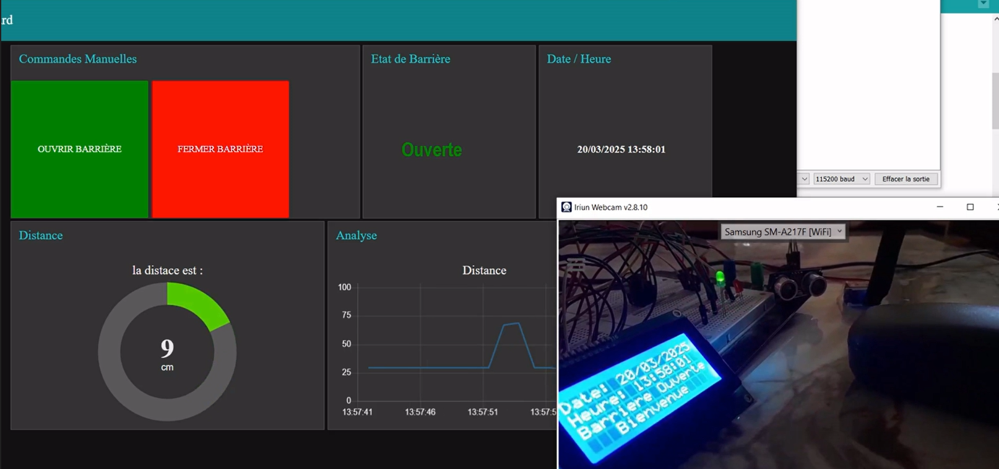

# 🚧 Smart Barrier System (Automatic & Manual) with ESP8266

This project presents an intelligent **automatic and manual barrier system** designed using an **ESP8266**, **ultrasonic sensor**, **servo motor**, and an **LCD display**. It supports **MQTT communication** for remote control and monitoring.

## 🎯 Features

- 🔍 **Automatic Mode**: Detects vehicles using an ultrasonic sensor and opens the barrier automatically.
- 🧠 **Manual Mode via MQTT**: Remotely control the barrier using MQTT commands (`ON` to open, `OFF` to close).
- 📊 **LCD Interface**: Displays current date, time, and barrier status.
- 🌐 **MQTT Integration**: Sends real-time data to the server, including:
  - Vehicle distance
  - Barrier state (open/closed)
  - Date & time (via NTP)
- 💡 **LED Indicators**:
  - Green: Barrier Open
  - Red: Barrier Closed

## 🛠️ Hardware Components

- ESP8266 (NodeMCU)
- Ultrasonic Sensor (HC-SR04)
- Servo Motor (SG90)
- LCD Display (1602A, 4-bit mode)
- Two LEDs (Red & Green)
- Wi-Fi Connection
- MQTT Broker (HiveMQ Cloud)

## 📡 MQTT Topics

- `barriere/distance`: Sends measured distance from the ultrasonic sensor  
- `barriere/etat`: Publishes current barrier state  
- `barriere/dateheure`: Sends date and time info  
- `barriere/commande`: Receives control commands (`ON` / `OFF`)

## ⚙️ How It Works

- On startup, the system connects to Wi-Fi and MQTT.  
- NTP is used to sync the system time.  
- In **automatic mode**, the system opens the barrier when a vehicle is within 10 cm.  
- In **manual mode**, the user can send MQTT commands to control the barrier.  
- The LCD displays the current date, time, and barrier status in real time.

## 📸 Demo

Here’s a preview of the system in action:

## 📧 Contact
Hazem BOUKOUBA - Embedded systems engineer with a passion for IoT.
For any questions or suggestions, feel free to contact me via www.linkedin.com/in/boukouba-hazem

